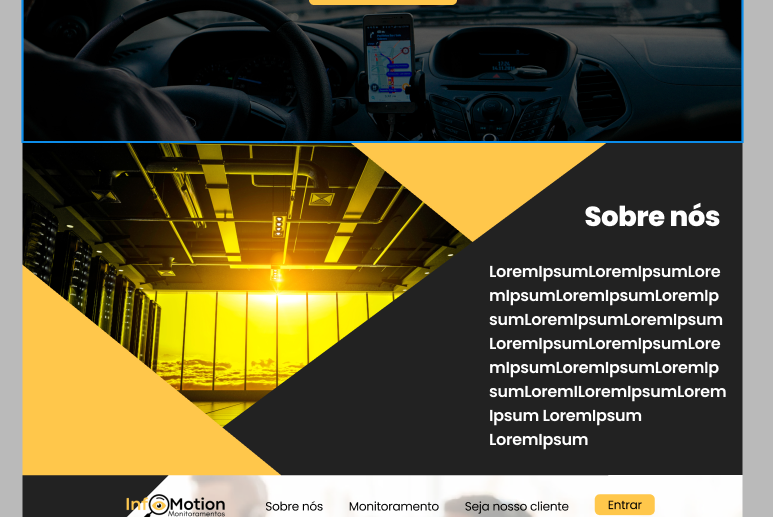
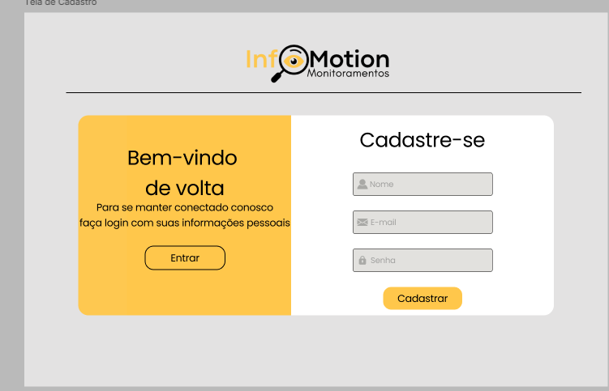

# InfoMotion

 Um projeto feito por alunos da SPTech, no segundo semestre, para a disciplina de PI - Projeto e Inovação. 

## Índice
- <a href="#funcionalidades-do-projeto"> Funcionalidades do Projeto </a>
- <a href="#protótipo"> Protótipo </a> 
- <a href="#tecnologias-utilizadas"> Tecnologias Utilizadas </a> 
- <a href="#autores"> Autores </a> 

## Funcionalidades do Projeto
- [x] Monitoramento de RAM, CPU e Disco em servidores de Banco de Dados de empresas de transporte urbano.
- [x] Armazenamento dos dados na nuvem AWS.
- [x] Cadastro e Login do Cliente.
- [x] Sustentação abertura de chamados pelo Jira.
- [x] Uso do Slack como meio de comunicação, para notif-icações.
- [x] Dashboard para tomada de decisão dos stakeholders.

## Protótipo
- Página Inicial

- Página de Login

- Página de Cadastro

- Página de Cadastro do Gestor

## Tecnologias Utilizadas
1. [Figma](https://www.figma.com/)
2. [Canva](https://www.canva.com/pt_br/)
3. [VSCode](https://code.visualstudio.com)
4. [MySQL Workbench](https://www.mysql.com/products/workbench/)
5. [Oracle Virtual Box](https://www.virtualbox.org/wiki/Downloads)
6. [AWS](https://aws.amazon.com/pt/)
7. [R Studio](https://rstudio-education.github.io/hopr/starting.html)
8. [Microsoft Planner](https://planner.cloud.microsoft/)
9. [Github](https://github.com/)

## Autores
- Breno Otavio Silva Costa.

- Erick Araujo Ferreira.

- Gabriela Pinheiro Lopes da Cunha.

- João Vitor Lira Alves.

- João de Oliveira Neto.

- Kauã Medeiros.

